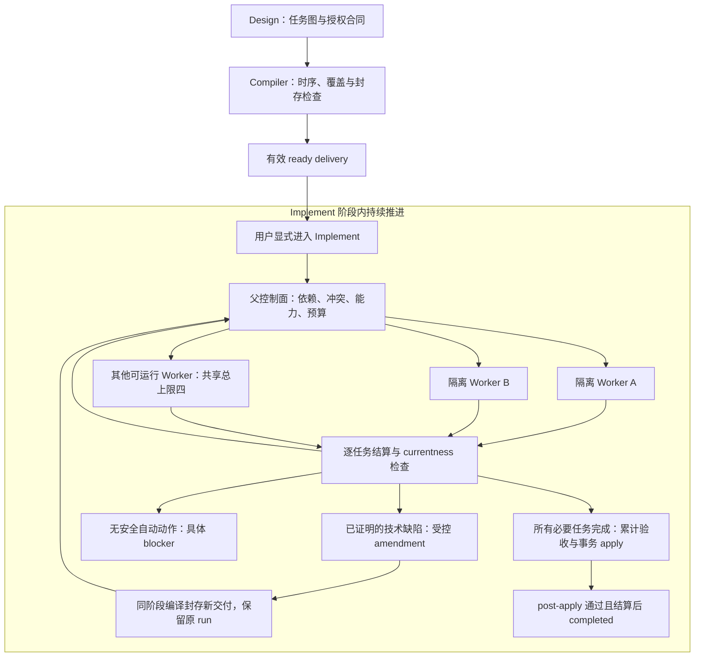

# Design 规划并行交付，Implement 持续执行

本文是 Cadence 自身的架构设计提案，不是已编译、已批准或已封存的 Abel delivery，也不激活 Abel 阶段。

## 目标与范围

Design 负责形成可独立委派、输入时序正确、授权完整的任务图；Implement 负责根据实际前提持续调度多个隔离 Worker，在有界恢复后完成累计验证和事务应用。

用户批准目标和边界后，不再为同一范围内的实现选择、每个 Worker 的启动或常规技术修订反复审批。
只有没有安全自动动作时，才报告具体 blocker、保留进度和最小外部恢复条件。

首期扩展现有 compiler、scheduler、status 和 amendment 路径。
保留四个共享执行槽位、现有路由策略和 Linux 隔离，不实现第二套引擎、通用能力平台、跨任务阶段级抢跑或 host-trusted 产品功能。

## 已核实的基础和缺口

- `contracts.ts` 已定义四个共享 child session 槽位；`workflow-state-machine.ts` 和 `workflow-scheduling.ts` 已支持独立任务并行、跨 run 容量和持久冲突队列。
- `workflow-policy.ts` 已检查显式冲突、共享资源、读写路径、AGENTS 目标和验证锁。
  首期保留保守的任务级冲突规则，通过 Design 改进任务拆分和读取范围，避免不必要的串行。
- 当前调度循环等待一批任务的 `Promise.allSettled` 后才选择下一批；单个任务释放槽位后，可运行任务可能仍等待同批慢任务。
- `implement-graph.ts` 正确允许 Red 生成验证输出、Green 消费该输出，但 compiler 对 affected、repair、baseline/full-suite 等合同缺少完整的消费时刻检查。
- `change-verification.ts` 在候选启动前采集所有任务的 affected baseline；未来测试或其他任务的局部能力缺失可能阻塞当前独立任务。
- 缺失和不安全输入被压缩成 `input-missing`；baseline 失败又被投影为 `environment`，无法可靠决定恢复动作。
- 已有同阶段 amendment、Gate A 继承、Gate B 编译、交付发现和持久预算；普通 baseline `input-missing` 无法进入这条路径。
- `delivery-invalid` 对不同交付诊断提供同一种 amendment，需要按可信原因收紧，不能将 hash/receipt 异常直接视为计划修订权限。

调查中的合成工作区复现了“编译检查通过、baseline 输入缺失、status 无 continuation”。
四个相关测试文件本次为 48/48 通过；这不是实施前的完整测试基线或原生验收。

## 责任边界

| 层                 | 唯一责任                                                     | 不持有的权限                                                 |
| ------------------ | ------------------------------------------------------------ | ------------------------------------------------------------ |
| Design 父代理      | 目标分解、依赖依据、文件所有权、验收和交付合同               | 产品实现、伪造运行能力和验证结果                             |
| Compiler           | 检查授权、图闭包、输入时序、验证覆盖、规范身份和封存条件     | 执行产品测试来代替授权、自动删减验收                         |
| Implement 父控制面 | 准入、调度、预算、修订批次、合并、累计验证、apply 和状态转换 | 放宽 Gate A、绕过 currentness                                |
| Worker/subagent    | 在一个任务的隔离候选中执行当前阶段并提交结构化产物           | 主工作区写入、审批、控制数据库、自行扩展任务或无限生成子代理 |
| Verifier           | 在指定 revision 和环境上执行合同并返回事实                   | 决定扩大授权、把基础设施失败当 expected-red                  |

开发 Cadence 的 Codex subagent 与 Cadence 产品内的 Worker 是两层不同执行机制。
开发时的代理同样必须有明确、互不重叠的写集；共享接口和集成由父代理负责。

## Design：产出可以委派的计划

每个任务沿用现有合同，明确以下信息：

1. 稳定 taskId、目标、验收归属，以及足够让全新 Worker 开始工作的上下文。
2. 最小依赖及其原因。
   相似主题不构成依赖；消费另一个任务的产物、共享接口尚未确定或存在真实资源约束才构成依赖/冲突。
3. 精确阶段 read/write/delete、输出 producer 和 postcondition。
   公共类型、manifest、生成物等共享修改由明确的前置任务或父集成步骤负责。
4. baseline、Red、Green、可选 Refactor、affected、repair、累计及 post-apply 验证的输入和验收覆盖。
5. 资源冲突、验证锁、能力前提和失败影响范围。
   估计耗时和推荐并行组只能是提示，不能授予执行权限。

基于任务图和现有冲突计算投影“当前可并行任务、需等待的 producer、串行原因”。
不另存容易失真的第二份调度图，不为达到某个并行数量而过度拆分。

例如：公共接口任务完成后，三个互不冲突的模块任务可并行；集成任务等待其必要 producer 完成。
只有两项独立工作时使用两个槽位；单文件强耦合工作允许串行。

跨任务仍以 producer 任务完成及其输出事实有效为准，不提前消费另一个任务尚未完成的 Red/Green 中间产物。

## 验证输入的时间模型

在现有完整任务合同中增加明确的任务级 baseline verification。
作者输入可省略，但仅在 affected 输入均可在原始 revision 安全读取时，编译器才能沿用原 affected 合同；不得在执行时悄悄过滤不存在的测试。

| 消费时刻                          | 可用输入                                       |
| --------------------------------- | ---------------------------------------------- |
| 原始 baseline                     | 原始快照中的安全普通文件，不依赖本交付未来输出 |
| Red 候选验证                      | 原始输入、当前 Red 候选产物、已完成依赖输出    |
| Green/Refactor 候选验证           | 当前候选、同任务已提交前序阶段及已完成依赖输出 |
| 任务 affected/repair              | 该任务最终阶段实际可用的输入及依赖输出         |
| 累计/AGENTS checkpoint/post-apply | 相应屏障时刻的完整产物和仍然存在的既有输入     |

检查 producer 的可达性、顺序、路径安全和中途删除。
已有文件同时作为后续修改输出时，baseline 可以读取其原始字节，不能简单地将“存在 producer”等同于“baseline 不可用”。

新测试必须保留在目标阶段、affected 和完整验收中。
任务没有既有测试时，明确绑定可执行的既有回归或全量 baseline；未执行的检查不能写成 passed。
失败归因只在可比较的验证义务/失败身份之间复用，新增测试不能获得“预先存在失败”的豁免。

静态闭包只证明声明的输入和已支持适配器，不证明任意脚本内部所有动态依赖。
执行时仍检查实际输入、环境身份和 currentness。

对已保留 run，修订的 baseline 检查必须针对该 run 的原始不可变 revision。
当前主工作区后来增加的文件不得用于修好原始基线。

任务级 baseline 按需采集并独立缓存；全局 baseline 仍绑定原始 revision。
缓存绑定验证合同、输入身份和环境身份。
局部采集失败不能丢弃其他已成功采集的证据，或提升为所有独立任务的启动前提。

Design 必须把准备工作与后续外部资格/集成正确划分。
真正的全局验收仍是全局屏障；不能为了并行而将缺失原生能力包装为 executable，或将准备交付的 ready 解释为原生资格通过。

## Implement：持续补充可运行任务

保留状态机作为唯一转换权威，将按整批等待改为按任务结算驱动的有界调度循环：

1. 读取当前交付、任务/阶段证据、依赖、冲突、容量、预算及 blocker 前提。
2. 选择前提满足且无冲突的任务，在现有事务内预留预算和共享槽位。
3. 通过现有路由和私有 child session 启动隔离 Worker；任务内保持 Red→Green→Refactor 顺序。
4. 任一任务完成结算后，重读最新事实，立即补充可运行任务，不等待其他独立慢任务结束。
5. 没有 runnable 但仍有活动任务时等待结算/容量事件；没有活动工作且没有合法自动动作时才返回暂停。

共享容量仍为四，覆盖并发 run。
冲突排队沿用 FIFO，保留跨 run 公平性；等待依赖或容量不消耗 Worker 尝试预算。

槽位释放必须发生在对应执行操作与资源结算后，不能以模型返回或取消请求发出作为释放依据。
cancel/close 必须等待全部已启动操作和后代处理结算，不能留下后台写入。

并行候选进入同一个累计 revision 时，复用既有合并/currentness 保护。
需要重验证的候选不能仅因独立任务完成就被视作有效；主工作区最终 apply 仍由父控制面串行、事务化执行。

## 局部阻塞和受控恢复

复用现有结果和持久恢复事实，增加有界的失败原因及恢复前提。
最小事实包括：真实 owner、scope、verificationId、输入路径、安全观察、producer、baseline/candidate revision、相关环境身份和失败序号。
不要依赖错误消息关键词或 Worker 自报分类授予权限。

| 原因                                                      | 下一步                             | 影响范围                     |
| --------------------------------------------------------- | ---------------------------------- | ---------------------------- |
| 依赖未完成、容量或合法锁占用                              | 等待已有任务/资源结算              | 相关任务排队                 |
| 已证明的计划时序/验证合同缺陷                             | 父代理受控 amendment               | 相关任务及依赖者             |
| Worker 漏产物、候选或范围内回归                           | 原预算内纠错/repair                | 对应任务                     |
| runner/依赖漂移或短暂环境故障                             | 前提变化的探测通过后，有界重试     | 受该能力影响的任务           |
| 真正外部能力缺失                                          | 报告最小外部条件，继续安全独立任务 | 局部；若为全局必要条件则全局 |
| 不安全路径、未知错误、hash/receipt/currentness 完整性问题 | 停止相关执行，核实并恢复可信前提   | 按安全影响范围，必要时全局   |
| 明确取消、预算耗尽、无法安全终止                          | 诚实暂停并保留进度                 | 对应授权/资源范围            |

缺失未来产物、缺失既有文件、依赖漂移与不安全路径必须分别判定。
旧 run 中只有 `input-missing` 时，只读重查保留计划和原始 revision；证据不足则保持暂停，不自动升级权限。

修订复用现有 batch-bound `amend`：汇总同 change 的技术问题，保留 Gate A/ChangeContract，重新编译 Gate B 和封存，自动发现新 revision 后在同一个 Implement run 继续。
无需用户复制 receipt、切换阶段或逐个同意 Worker。

修改交付前先停止启动将受修订影响的新任务，并等待已有操作安全结算，在现有独占 lease 下修订；不得在运行中的 sibling 使用旧交付时直接替换它的执行合同。

baseline 专属修订应仅失效受影响的 baseline/归因证据。
未改变的 Red/Green、候选、任务成果和检查点经过兼容性及 currentness 检查后保留；需要重验证不等于清空旧证据或返还预算。

环境恢复以具体能力、输入或环境身份变化为条件。
允许有界、无 Worker 的安全探测；没有可核实变化时，不重复执行相同失败验证。
下一次探测时机、次数和超时必须有界，不能建立无限轮询。

同一失败事件、相同交付/输入/环境下的 resume 返回稳定 blocker，不再次启动 Worker或重复消耗执行预算。
合法进展可以是前置产物完成、新有效交付、能力恢复、已验证输入或环境变化；仅更换 operationId 不构成进展。

## 用户看到的状态

继续使用现有状态词汇，不引入第二套 run 状态机。
status 从父控制面收集的事实投影：

- 已完成、活动、排队和受阻任务；排队明确说明依赖、容量或冲突。
- 运行中的独立任务继续展示活动，不因某个 sibling 受阻把整个 run 显示为已停止。
- blocker 的具体原因、影响任务、最小恢复条件、是否存在自动动作和已保留预算/证据。
- 已有 continuation 负责触发父代理下一步；status 本身不执行动作，不生成审批或修改存储。

内部可以保留完整 blockers/batch；面向用户合并同因问题，优先报告当前真正阻止最终完成的条件。
任务、候选和修订完成不能冒充整个 run completed。

## 安全和兼容性

- 不绕过 Gate、receipt/hash、traceability、currentness、隔离和事务 apply。
- 不直接创建未来测试来改变原始 baseline；不删除验收以获得通过。
- 不自动激活/切换 Abel 阶段，不自动 discard、开启 trusted 模式或调用外部发布操作。
- 不清空任务、检查点、证据或预算；不通过改名、新 run 或重复编译获得恢复额度。
- 延续现有工作、修订和恢复预算；技术修订不提高容量。
  只有现有策略明确允许且确有更多有效阶段的拆分，才可按原规则调整高水位，不能通过空任务增加额度。
- 新持久字段使用已有 schema 的可检查、原子 additive 机制。
  旧证据保持可读，缺少新证明的旧记录不默认可信；不得借 package version reset 迁移此功能。
- 不操作用户保留运行，不修改 host-trusted 案例内容。
  仅在合成工作区/状态存储复现它的结构。
- 保留现有 Linux bwrap、fsync、异常暂停、interrupted 修复、后代终止和事务恢复。
- 保留已有工作区改动，不撤销、提交、发布；如需改 AGENTS，仅修改管理区，区外字节完全保留。

## 实施分解和验收

先记录目标、受影响和全量测试基线，再按有依赖的小步 Red→Green→Refactor 实施。
优先建立共享合同，再并行开发边界明确的模块，最后由父代理集成。
这个顺序本身不授予跨模块代理任意写权限。

| 步骤              | 主要现有模块                                                                                                         | 必须先失败后通过的验证                                                                                       |
| ----------------- | -------------------------------------------------------------------------------------------------------------------- | ------------------------------------------------------------------------------------------------------------ |
| 输入时序合同      | implement-plan、plan-draft、delivery-compiler、implement-graph                                                       | 未来 Red 测试不进入原始 baseline；同阶段/Red→Green/合法跨任务依赖继续成立；后置消费和删除检查                |
| 基线与失败事实    | verification-capability、package-verification、durable-contracts、change-verification、phase-execution               | 区分 absent/unsafe/漂移；新增验收保留；局部基线失败不阻塞独立任务；归因不会豁免新增失败                      |
| 持续并行调度      | workflow-state-machine、workflow-scheduling、workflow-policy                                                         | 至少两个独立任务实际重叠；最高四槽位；一个快任务结算后立即补位；依赖/冲突不抢跑；排队不消耗预算              |
| 修订和恢复        | workflow-policy、workflow-status、workflow-state-machine、delivery-revision、durable-workflow、必要的 storage-schema | 同 run 修订/reopen 保留进度预算证据；无变化 resume 不重启；未知/不安全故障无修订权限；修订与活动任务安全结算 |
| Design 与入口接线 | design-control、index、plan-draft-summary、design-diagnostics、两个阶段 prompt 和作者示例                            | 展示实际并行/阻塞原因；tool 返回 continuation；无重复 Gate A、无阶段切换、无内部凭证人工搬运                 |

回归使用现有 graph、verification-capability、verification-attribution、workflow-status、workflow-engine、runtime-worker-broker、design-delivery 和恢复/隔离套件。
并发测试使用受控屏障证明启动/结算顺序，不能只看最终成功或依赖容易波动的耗时阈值。

最终执行 `bun run verify`、`bun run traceability:check` 和适用的真实 Linux bwrap 回归，对照基线区分新增失败与预先存在失败。
单元、模拟平台和真实平台结果分别报告；无法执行的必要验证必须作为具体未完成项，不声称原生通过。

功能完成标准：编译期阻止已知输入时序陷阱；可运行独立任务持续占用可用槽位；局部失败不阻断独立成果；授权内技术缺陷经有界修订自动续跑；无进展重试被阻止；全部必要验收和事务 apply 仍是运行成功的前提。
