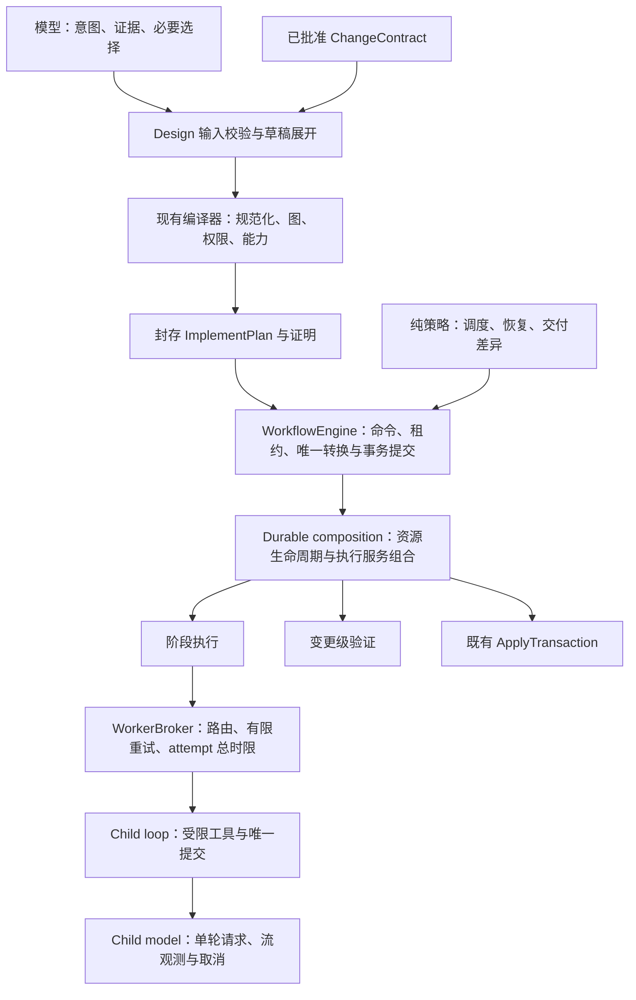

# Cadence 架构与协议成本复核方案

2026-09-07；核对基线为 `1fc103cb7adaf59840ffc71eef0fe7f5ab7a6e50` 的当前源码。
最初为普通任务下的调查与架构提案；用户随后批准全部优化并授权实施。
本次继续按普通工程任务实施，不自动激活 Abel 阶段；以下原始核对记录保留为修改前证据。

用户补充的两条约束纳入全部改动：精简作者输入与完整执行计划拥有独立类型，能唯一推导的机械字段由编译器补全；Pi 适配层只负责激活、用户交互、模型配置适配和展示。
控制服务接收代码拥有的命令、Provider 快照接口和活动数据，不接收宿主事件对象或 ExtensionContext。
将实现候选的提示/边界/结果处理移出 index，宿主事件只调用服务入口，不成为新的转换或恢复权威。

建议保留现有编译器、严格执行计划和单一状态转换权威，优先修正响应时限，再降低作者输入成本，最后按实际职责拆分控制核心。
不引入通用工作流框架、事件总线或第二套 AgentSession。

以下至“实现结果”之前保留实施前调查与原始方案；其中“当前”“本轮”均指修改前核对，不能作为修改后的状态。

四项问题在修改前代码中的状态如下。

| 问题                     | 本轮结论                 | 当前证据与限制                                                                                                                                        |
| ------------------------ | ------------------------ | ----------------------------------------------------------------------------------------------------------------------------------------------------- |
| 协议正确性成本转给模型   | 部分改善，仍然存在       | 单任务示例现在是 175 行；tracking、verificationInputs、测试归属已能推导，验证契约和阶段声明仍重复。不能用示例行数直接衡量模型成本。                   |
| 控制核心职责过多         | 仍然存在，已有局部拆分   | 状态机 4,164 行，durable composition 4,181 行；状态投影与候选工件校验已经提取，执行、恢复与交付修订仍大量交织。                                       |
| 自管子执行器的维护负担   | 边界已改善，属于持续约束 | child-session 609 行，child-model 99 行；未使用 createAgentSession，使用公开 streamSimple、参数校验与资源清理接口。没有证据表明已经重建完整宿主会话。 |
| connect-timeout 名实不符 | 仍然存在，本轮再次复现   | attempt 启动后 10 秒内未收到 headers 或流进展就取消；没有 TCP/TLS 建连观测。                                                                          |

[草稿编译入口](../../src/delivery-compiler.ts)的 preparePlanDraft 只补缺失字段，再交给严格规范化、图、权限及能力校验。
parseImplementPlan 不做作者输入补全，这是应保留的正确边界。
[现有草稿减负记录](design-authoring-redesign.md)已经明确：最近两次多任务实评在提交计划前截止，没有验证这次推导改动的模型端收益。
因此不能把更早的 verification binding 错误直接算作当前版本重新发生的错误，也不能宣称它们的实际交互成本已经消失。

目前仍可直接定位两个作者入口问题：

- [index.ts](../../src/index.ts) 的 Gate A contract schema 只暴露 string 或宽泛 object，详细结构放在描述文本中；[design-control.ts](../../src/design-control.ts) 校验失败统一返回 invalid-design-control-request，[change-contract.ts](../../src/change-contract.ts) 的具体值校验也被压成通用失败。
- [当前示例](../../config/plan-draft.example.json)在验收、Red、Green、affected、repair、baseline、fullSuite、postApply 八处重复描述同一个 Node 验证脚本。
  省略身份和绑定以后，作者仍在多次重述同一执行事实。

历史 [9:47 单任务记录](optimization-live-evaluation.md)可证明一次独立验收成功，不能证明当前版本稳定具备低交互成本。
[多任务诊断](multiple-task-timeout-diagnosis.md)把一次 600 秒运行分为本地工具 0.350 秒、调查子调用 20.015 秒、父模型及宿主处理 579.635 秒。
最后一项含等待、生成、传输及宿主处理，不能全部称为模型思考时间，也不能据此归因于调度器。
这些仍是历史测量；本轮没有运行外部模型，也没有 Trellis 同条件对照。

本轮通过局部测试和本地 HTTP 实验核对现状。

使用当前 WorkerBroker、原始超时常量和真实 loopback HTTP 服务，串行运行两个条件；不访问外部 Provider。

| 条件                           | 本轮观察                                           | 结果                                          |
| ------------------------------ | -------------------------------------------------- | --------------------------------------------- |
| 响应头延迟 11 秒               | 服务端约 21 ms 收到首次请求；约 10,007 ms 收到重试 | 两次 connect-timeout，20,008 ms 后返回 paused |
| 立即返回响应头，正文延迟 11 秒 | 约 2 ms 收到请求、4 ms 观察到响应头                | 一次成功，11,012 ms 完成                      |

服务端已经收到 HTTP 请求，足以排除“尚未连接”作为这次取消的准确描述；本轮脚本没有取得独立的客户端 TCP connect 时间，不把服务端请求时间冒充 TCP 测量。
实验脚本及原始输出保存在本机 `/tmp/cadence-response-boundary-recheck.mjs` 和 `/tmp/cadence-response-boundary-recheck.json`，属于临时核对材料，不作为发布包或持久测试入口。

运行以下既有测试：plan-draft、design-delivery、worker-broker、worker-transport-lifecycle、child-session、child-session-cancellation、architecture-boundaries。
结果为 7 个文件通过，143 项通过、1 项条件跳过。
这些测试确认现有推导与隔离接口的行为，没有把本地测试通过当作超时策略合理或外部模型体验通过的证据。

目标架构保留以下职责边界。



执行服务返回带来源与修订身份的事实或封闭 outcome；状态机决定是否接受、写入任务状态、预留预算和继续执行。
这保留既有“决定—执行—核对—提交”的结构，不需要将整个系统改写成通用 reducer/effect 框架。

时限修正首先要让预算对应可观测生命周期。

推荐把模型请求时限放进现有 requestChildTurn，将 broker 收敛为路由和 attempt 的拥有者。
一次 child session 可能多轮调用 streamSimple；当前 broker 的 headersSeen 却是 attempt 级的，且 idle 计时会跨过本地工具执行。
只把 connect-timeout 改个名字或把 10 秒增大，不能清楚处理第二轮请求与工具间隙。

| 预算或观测                     | 拥有者                 | 起止语义                                                               | 建议初始策略                                   |
| ------------------------------ | ---------------------- | ---------------------------------------------------------------------- | ---------------------------------------------- |
| firstProgressMs                | child-model，每轮请求  | 调用 streamSimple 前开始，到首个有效模型进展或完整终态；headers 不重置 | 先复用现有 90 秒预算作为政策起点，后续实测校准 |
| streamIdleMs                   | child-model，每轮流    | 首次进展后，到下一进展；完整终态、错误、取消时清除                     | 先保留现有 180 秒数值                          |
| attemptTotalMs                 | WorkerBroker           | execute 开始到整次子执行结束，含准备、所有请求和本地工具               | 保留现有每 attempt 20 分钟上限                 |
| 原有父操作时限与取消           | packet/workflow 调用方 | 按当前外层合同约束整个调用                                             | 内层补交、纠错及请求不得延长它                 |
| headersSeen / headersElapsedMs | child-model 的请求观测 | SDK 公开 onResponse 被触发时记录                                       | 仅诊断，不作 TCP/TLS 判断，不给额外预算        |

90 秒不是由这一次 11 秒实验推导出的最佳值；它只是沿用已存在的首响应容忍度，去掉错误的 10 秒前置限制。
firstProgress 的时长包含 SDK 请求准备和服务端等待，名称也不应声称是精确网络或服务器计算时长。
认证、Provider 快照等请求前准备仍受 attempt 总时限约束；本轮不另增一个凭空命名的网络建连计时器。

实现只需要 requestChildTurn 内的局部请求计时与现有回调接线，不新增传输服务或第三方 HTTP 客户端。
它继续依赖 Pick<Models, "streamSimple">，通过已有公开 options.onResponse 观察当前请求。
没有 onResponse 的 Provider 也能按流进展计时，诊断明确表示未观测到 headers。
协议适配、认证与网络实现继续由 pi-ai/Provider 负责。

进展使用明确的事件白名单，例如非空 text_delta、thinking_delta、toolcall_delta；完整终态直接结算。
start、HTTP headers、空事件和保活不能无限延期。
正常完成且没有 delta 的完整消息交给现有子提交规则判断，不能因为缺 delta 错报网络超时。
进入本地工具执行前已结束该轮流计时；工具继续使用自身限制与共享取消信号，下一轮请求获得新的请求计时。
展示按请求生命周期变化，收到迟到 headers 不得让 running 倒退。

错误码建议使用 first-progress-timeout、stream-idle-timeout、attempt-timeout，并带封闭的 request/attempt scope。
沿 child-model → child-session → packet/durable → broker 的类型化失败通路保留这些码，不能在中间重新压成 child-provider-stream-error。
请求计时触发的局部 abort 与父操作取消使用不同的类型化原因；不能因都使用 AbortSignal 就将请求超时记为用户取消。
同步更新失败白名单、路由健康、暂停状态和 TUI；旧存储的 connect-timeout、first-response-timeout、idle-timeout、phase-timeout 继续按历史语义读取，保留原始值，不改写历史事实。
不再发出暗示 TCP 观测的 connecting 展示，改为准备子执行、等待模型响应、运行中。

broker 仍是唯一的重试/换路由拥有者，SDK maxRetries: 0 和原有尝试次数保持不变。
必须明确：当前 20 分钟是每 attempt 上限，不是跨所有重试的整个 workflow 上限。
是否新增跨 attempt 的总时限属于另一项可见政策变化，本方案不把它夹带进命名修复。
取消或超时后关闭结果接收，保留目前最多 250 ms 的协作用量结算窗口；迟到 Promise 的异常被吸收，迟到候选不能进入封存、合并或 apply。

这一步的回归应覆盖：11 秒 headers 延迟成功；headers 后长期无进展；无 headers 回调但有正常流；第二轮请求停滞；工具间隙不算流空闲；空事件不续命；立即 HTTP 失败；终态无 delta；取消和迟到 headers/usage/result；两条并行路由的计时互不影响。
主要用可控时钟验证边界，再保留一组真实本地 HTTP 合同。
总时限、有限重试与健康状态不能只靠计时器单元测试证明。

作者输入继续扩展 PlanDraft，不再增加一门计划语言。

保留一条展开路径：作者 PlanDraft → 完整候选计划 → 原有严格编译器。
从 delivery-compiler 提取一个内部 plan-draft 模块承接现有 preparePlanDraft 和新增简写展开；执行层完全不感知简写。
不新增持久草稿数据库、脚本模板引擎、自然语言计划解释器或多层 builder API。

| 信息       | 作者仍需选择/举证                                                             | 代码可以承担                                            |
| ---------- | ----------------------------------------------------------------------------- | ------------------------------------------------------- |
| 验收与权限 | goal、acceptance、constraints、writeRoots、依赖、验证模式；批准是真实外部事实 | 沿用 journal 中已批准合同，生成身份及证明               |
| 任务与图   | 稳定 taskId、objective、dependsOn、output 路径和生产阶段                      | 校验拓扑、计算闭包；不默增依赖或猜 producer             |
| 读写范围   | 精确的阶段写入/删除与必要读取；AGENTS 影响结论                                | 允许显式公共 read 声明展开；不能从 verifier 自动扩权    |
| 测试调查   | 相关测试路径、调查证据、影响范围与受影响套件                                  | 延续现有测试归属和 verificationInputs 推导              |
| 验证       | 具体可执行契约、Red 失败身份、各验证义务选用哪个契约                          | 复用命名契约，生成用途身份与由角色固定的 classification |
| 恢复       | artifactCorrection.maxAttempts、repair.maxAttempts 等资源选择                 | 固定的边界保护常量和 parent tracking 规则               |

第一步只加两种局部能力：命名验证复用，以及可选的任务公共 read。
以下是拟议的局部输入示意，尚未实现，不能当作完整可编译样例：

```json
{
  "verificationDefinitions": {
    "add-test": {
      "kind": "static-check",
      "runner": { "kind": "node", "script": "test/add.test.mjs" },
      "args": []
    }
  },
  "tasks": [{
    "taskId": "fix-add",
    "read": ["package.json", "src/add.mjs", "test/add.test.mjs"],
    "phases": {
      "red": {
        "write": ["test/add.test.mjs"],
        "delete": [],
        "verification": { "use": "add-test", "expectedFailure": "[ADD:positive-integers]" }
      },
      "green": {
        "write": ["src/add.mjs"],
        "delete": [],
        "verification": { "use": "add-test" }
      }
    },
    "affectedVerification": { "use": "add-test" },
    "repairVerification": { "use": "add-test" }
  }]
}
```

复用的是验证命令的声明，不是已运行的验证结果。
Red、Green、affected、repair、baseline、fullSuite、postApply 的独立执行与报告继续保留。
全套与 postApply 的选择也要显式引用，不能仅凭“单任务”默认等于 Green。
Gate A 保留完整验收验证合同；PlanDraft 沿用已批准 authority，第一版不增加跨 Gate 的可变符号引用。
这样先消除 draft 内的重复，不制造批准后引用被替换的风险。

定义区只支持已有原子适配器的命令字段，不允许定义引用另一条定义；现有 ordered-steps 和特殊情况仍可内联完整契约。
use 不允许任意字段覆盖；expectedFailure 只在需要 Red 证据的使用点填写。
先展开，再执行原有 validateVerificationContract、执行输入绑定及完整 readiness 校验。
编译器按稳定 taskId、验证用途及规范命令生成有域分隔的合法 ID，不能用任务数组下标；碰撞明确拒绝，显式 ID 保持原值。
顺序敏感的 args 和 ordered steps 不参与集合排序。

公共 read 是作者显式授予所有该任务阶段的共享读取集合，阶段可另加 read；有特殊隔离需求的任务继续只写各阶段 read。
展开结果显示每个阶段最终权限；roots、write、delete 不因省略而自动扩张。
AGENTS impact、changedSurfaces、调查证据不能用默认 none 代替调查结论。
恢复次数与授权开关也不能借由“默认 profile”被隐藏或增大。

新简写只在编译入口展开：历史完整输入及其 ID 不变，已有封存计划继续严格读取。
精简输入应与其完整展开形式得到相同规范字节；引入新生成 ID 的输入，不承诺与任意旧人工 ID 的历史计划哈希相同。
不重写已批准计划，不迁移旧运行来套用新默认值，不忽略显式错误。

入口改进应先提供足够具体的结构与诊断，再减少不必要的调用轮数。

Gate A 的运行时校验和工具参数应共享同一份代码拥有的结构定义，保留手写的语义检查；不维护“宽泛工具 schema + 隐藏严格规则”两套表述。
复用现有 schema 能力即可，不加入通用反射注册中心，也不把全部 contracts 一次改写成另一套库。
继续允许读取历史字符串合同，新工作展示完整结构化合同。

validateDesignControlRequest 返回有界 diagnostics，沿 index 的真实工具错误通路保留它们，并复用 design-diagnostics 的安全投影。
例如 contract.acceptance.0.verification.expectedFailure 或 contract.policy.verificationModes，配合稳定错误码及代码生成的修正提示。
只报告字段位置、允许的类型/枚举与安全路径，不回显合同正文或未经筛选的用户值。
共享结构定义不应扩大工具 prompt：复用结构并按当前工具接口允许的方式描述，测量 token 成本，避免将整个 ImplementPlan schema 重复灌入每轮对话。

validate-plan-draft 成功时同时返回有界摘要：任务依赖、最终阶段读写、验证用途及引用、恢复次数、派生项来源和现有 canonicalHash。
失败时继续按独立任务批量报告；结构层失败时抑制依赖于无效结构的下游噪声。
compile-plan 仍重新执行当前性检查和封存，预检摘要不能充当旧输入上的批准证明，也不缓存授权结果绕过 finalization lease。

沿用现有 start/status 的 legalOperations，提供当前一步所需的字段指引与安装示例位置；先不增加新的控制命令。
简单需求由父模型用已取得的证据直接设计；仅在独立证据缺口有实际价值时使用调查子调用。
把独立读取和已授权的独立产物写入安排在同一轮现有工具调用中，每个写入仍使用独立操作 ID 和现有租约/重放规则。
存在数据依赖的操作顺序执行；不为降低轮数引入任意批处理 DSL，也不改变 Design/Implement 的显式阶段交接。
这些改动旨在减少串行模型往返，不能承诺消除 Provider 的生成或等待时延。

控制核心的拆分以迁出计算和执行、保留事务提交位置为准则。

下面是目标边界，不要求在一个变更中创建全部模块。
新增内部模块使用普通函数或小型组合对象，只有获得明确资源所有权的执行模块才使用可变对象。

| 边界                     | 从哪里迁出                                                        | 输入与输出                                                                       | 明确禁止                                         |
| ------------------------ | ----------------------------------------------------------------- | -------------------------------------------------------------------------------- | ------------------------------------------------ |
| workflow-scheduling      | 状态机 #hasConflict、#dependenciesVerified、#advance 中的选择逻辑 | 任务事实、依赖、当前占用、已尝试任务 → runnable 与 queue 原因                    | 数据库、启动 Worker、预留容量、改变任务状态      |
| workflow-recovery-policy | #runTask/#resume 的恢复判定与现有 decideRecoveryAction            | 失败事实、验证义务 key、历史次数、grant → 有限恢复建议/暂停原因                  | 自行发 grant、扣预算、重置失败历史               |
| delivery-revision        | #admitDelivery/#assertAmendmentContract 的比较与失效闭包计算      | 已批准合同、旧新计划、保留事实 → 保留/失效任务及原因                             | 加载外部交付、接受批准、更新当前修订、重建工作区 |
| phase-execution          | durable 的 runAttempt、普通/修复/Red 纠错执行                     | 单阶段任务、baseline、取消、既有预算预留能力 → WorkflowAttemptOutcome 与封存事实 | 主工作区 apply、run 转换、自己增加恢复次数       |
| change-verification      | durable 的 baseline/affected/cumulative/postApply 观测与归因      | 修订、验证合同、环境身份 → 独立报告、归因、必要的修复目标                        | 自行完成任务、把失败当成功、自行进入下一阶段     |

原有 workflow-status、candidate-artifact、verification-capability、package-verification、ApplyTransaction 继续承担已有职责，拆分时复用它们。
durable composition 保留 run 资源表、打开/关闭、mergeTail、环境与 ledger 的生命周期，并把变更级修复目标交给 phase-execution。
phase-execution 不反向导入 change-verification；共享的底层验证操作沿现有验证适配器单向调用。
阶段与修复只共享已确认相同的候选处理步骤，普通越界纠错与修复扩权的分类继续各自显式表达。
避免做成带十几个布尔选项的万能 execute(mode) 函数。

三个纯策略模块只接受已读事实，不传整个 WorkflowEngine、数据库或可执行回调。
执行模块则获得按职责收窄的 workspace/ledger/verification 能力与原有 reserveCandidate/recoveryDecision 能力；不能简单把整个 DurableRunResources 当作万能 context 搬过去。
模块可以有自己的工件事实写入，但持久 run/task 转换与预算事务仍只有状态机拥有。

保留四个容易在拆分类时破坏的时序：

1. 调度先计算候选，状态机在当前租约及新鲜事实下重新核对，再同步预留共享四任务容量和工作预算，之后才 await 启动；纯函数快照不是并发锁。
2. 阶段服务先完成验证和候选事实封存，状态机核对 operation、delivery、lease 与取消状态，再接受 outcome；旧调用的迟到返回不能改变新修订。
3. 合并仍经 run 级 mergeTail，修订更新与回滚沿原有提交顺序；变更级修复不能绕过同一预留预算回调。
4. cancel/discard/close 先取消并等待所有命令及执行服务结算，再释放资源和关闭存储；ApplyTransaction 保持既有主工作区当前性检查、日志与恢复顺序。

delivery-revision 只负责差异判断；durable.revalidateDelivery 继续负责真实修订重放、输入当前性与保留工件重建。
不能把“计划差异看起来相同”当作环境、工作区和验证证据仍然有效。

contracts.ts 与 index.ts 暂不按行数全面拆分。
本轮触及 Gate schema 时只移动其共享结构定义；将来验证合同成为独立变化单元时再提取 verification-contracts，保留 contracts facade 的导出与依赖无环。
index 继续是宿主激活、工具注册和组合入口，避免把它拆成拥有隐式全局状态的插件框架。
验收看依赖、资源所有权、事务时机和行为，文件行数仅作观察指标。

子执行器维持有限工具循环，后续只补必要的资源上界。

保留当前四个只读工具和一个提交工具、完整消息后执行、源顺序批次、最多两次结构提交、一次补交提醒、原截止时间和唯一终态。
Provider 方言适配、重试和父会话配置各守原有边界，不增加记忆、工具发现、会话持久化、自动模型切换或递归子代理。

当前 child-session 虽有时间、单次工具输出和提交次数限制，但 context.messages 持续追加，没有显式累计上下文字节、模型轮数或总工具调用数上界。
这不是已复现的内存事故，但它是“小型受限执行器”尚可补齐的资源合同。
建议只增加累计上下文字节和模型轮数两项硬上限，包括初始 prompt、schema、完整消息和工具结果；沿现有结构化限制失败返回，不自动总结或静默截断证据。
具体阈值用现有有效子执行样本及模型容量校准，作为代码拥有的运行限制，不让 PlanDraft 作者填写。
字节限制不等于精确 token 限制，不新造 tokenizer 或声称保证所有 Provider 的 context window。
若有效任务触顶，明确进入现有可恢复失败/拆任务流程，broker 不应把它误判为端点故障反复重试。

继续用确定性 Provider 与已有真实 HTTP 合同验证 usage、stop reason、部分消息不执行、取消、重复提交和迟到响应。
对外只承诺实际测试过的 pi-ai 版本；不为覆盖未知 Provider 扩张私有协议兼容层。

建议按以下顺序交付，并在每一步满足条件后停止该步扩张。

| 顺序 | 独立交付                         | 通过条件                                                                                    |
| ---- | -------------------------------- | ------------------------------------------------------------------------------------------- |
| 1    | 请求计时边界与错误/TUI 迁移      | 本地延迟 headers 合同及多轮/工具/取消测试通过，旧暂停事实可重开，次数和总预算无隐式扩大     |
| 2    | Gate A 结构及字段诊断，预检摘要  | 真实工具失败—修正往返无需读取 harness；诊断不泄露原始值，批准证明与重放行为不变             |
| 3    | PlanDraft 命名验证与公共 read    | 单任务及有 output 依赖的多任务样例可编译；精简/完整展开等价，旧封存读取严格，显式错误仍拒绝 |
| 4    | 调度、恢复、交付差异的纯计算拆分 | 容量、租约、重启恢复、grant、amendment 失效闭包及命令 drain 行为相同                        |
| 5    | 阶段执行与变更验证分离           | Red/Green、baseline、累计归因/修复、merge、回滚、postApply、真实隔离及存储重开通过          |
| 6    | 子循环累计资源上界               | 持续只读循环可有界退出，有效提交路径不受影响，限制失败不触发无意义换端点                    |

1–3 带有行为变化，分别建立能复现旧缺陷或证明新输入需求的失败测试后再实现。
4–5 先固定现有行为证据，逐步移动实现，不同时更改状态、预算、存储 schema 或批准政策。
每步验证自己的边界；进入实现后的相关交付运行项目要求的 verify、traceability 和分发检查，涉及执行/存储的步骤额外运行真实 Linux 隔离与新进程恢复验收。
本轮文档核对未运行这些全量实施验收，不能把提案标为 READY_TO_IMPLEMENT 或已实现。

1–3 完成后先实评，再决定是否需要更多作者 API。
沿用已有评估器，同模型、reasoning、Provider/路由、需求、时间窗和独立 oracle；固定代码版本，交错执行旧/新方案，至少各做多次单任务与多任务尝试。
初步每格 5 次可用于工程判断，仍须展示所有结果而非声称统计显著。
记录每次是否提交计划、首次 Gate/预检通过率、协议返工轮数、harness 源码查阅、父模型请求数、token，以及 Design/交接/Implement/oracle 各自耗时和状态。
将截至超时仍未到达的阶段记为未到达；已到达但被截断的时长单列，不能当作成功耗时参与平均或中位数。
小样本不报貌似稳定的 p95。

确定性验收门槛是：示例与新增错误修正路径不依赖 harness 源码，批准和执行不变量全数保留。
真实体验验收看独立 oracle 完成率不退化、协议返工与源码查阅减少，并报告同条件耗时是否改善；若证据混合，就继续报告未证实提速。
若这几步已明显减少协议轮数，就停止扩展作者接口；若时间仍耗在长生成或 Provider 等待，单独研究该边界，不能靠继续拆类宣称解决性能问题。

这套方案的成功标准是模型少重述事实、错误能就地修正、时间预算含义真实、每个状态提交仍能追到同一权威。
更小的文件和更短的 JSON 只是可能的结果，不作为替代验收。

## 实现结果

2026-09-07，用户追加的两条原则已纳入实施。
本次没有添加通用框架、事件总线、持久草稿语言或第二套宿主会话。

| 范围               | 已实现边界                                                                                                                                    | 验收依据                                                                                                 |
| ------------------ | --------------------------------------------------------------------------------------------------------------------------------------------- | -------------------------------------------------------------------------------------------------------- |
| 精简输入与完整计划 | `plan-draft.ts` 展开命名原子验证、公共读取及机械默认值；`implement-plan.ts` 独立定义完整类型，sealed parser 不接收简写                        | 单任务与显式 producer 多任务示例、精简/展开等价、重排身份稳定、缺少依赖与显式错误拒绝                    |
| Gate 与预检反馈    | `change-contract-schema.ts` 共享工具/运行时结构；真实工具入口保留字段诊断；`plan-draft-summary.ts` 展示最终权限和实际派生来源                 | Gate 错误—修正的真实注册工具往返、binding 修正、动态键不回显                                             |
| 请求预算           | `child-model.ts` 每轮独立首进展/空闲计时；`transport-budget.ts` 固定 90 s / 180 s / 250 ms drain；broker 只拥有原有 20 min attempt 与有限重试 | 公开 pi-ai HTTP 适配器上响应头或正文分别延迟 11 s 均一次成功；空增量、多轮、工具间隙、取消及迟到事件回归 |
| 控制与执行         | 调度、恢复建议、交付兼容比较分别迁入内部模块；durable 保留生命周期/重放/apply 组合；阶段和变更验证获得窄服务接口                              | 四任务容量、恢复 grant、amendment、命令 drain、累计归因、修复及应用回归                                  |
| 有界子执行器       | 64 轮、4 MiB 序列化上下文；超限不会作为路由故障重试，不自动摘要或截断证据                                                                     | 持续只读循环及超大初始输入回归、既有提交/用量/取消测试                                                   |
| Pi 适配层          | `pi-adapter.ts` 投影 cwd 与模型能力；`package-workflow.ts` 组合控制服务；`package-candidate.ts` 处理候选执行；活动数据独立于 TUI              | 核心无 ExtensionContext/宿主事件依赖、依赖无环、并行调用保留各自模型能力来源                             |

阶段服务的资源类型排除主工作区事务，状态机仍独占持久 run/task 转换和预算事务。
这次未改存储 schema、批准规则、恢复次数或四任务容量；旧超时事实仍按原码读取，新请求不再发出 connect-timeout。
机械/refactor 草稿类型允许省略 Red，完整执行计划仍保留规范化后的阶段合同。

单任务示例由 175 行变为 122 行；按紧凑 JSON 序列化计算由 3,310 字节变为 2,176 字节，约减少 34%。
这不是模型 token、请求轮数或实际耗时的测量。
`durable-workflow.ts` 从 4,181 行变为 963 行，`index.ts` 从 1,832 行变为 1,441 行；`workflow-state-machine.ts` 仍为 4,075 行，未为行数目标拆散其事务权威。
新增阶段执行约 2,248 行、变更验证约 896 行，拆分依据是资源与职责，而非小文件数量。

确定性与实际工具验收已完成：

- `bun run verify`：类型/语法、lint、816 项测试通过、14 项条件跳过，真实打包 92 个成员与批准清单完全一致。
- 完成全量验证后补充“超大完整消息中的提交工具不执行”回归；请求/资源预算组 10 项通过，类型检查再次通过。
- `CADENCE_REAL_ISOLATION=1` 的隔离与 workspace I/O 验收：14 项通过，未静默退回无隔离模式。
- `CADENCE_REAL_OPENSPEC=1` 的四组契约测试：117 项通过、1 项条件跳过；本机为 Linux、Node 26.7.0、OpenSpec 1.12.0，这不是 CI 的 Node 22/24、OpenSpec 1.5.0 或跨平台矩阵结果。
- `openspec validate --all --strict --no-interactive`：6 个 change/spec 全部通过。
- `bun scripts/seed-acceptance.mjs`：新进程执行、子模型、账本和应用验收通过。
- `check:agents` 和 `traceability:check`：索引有效，64 项活动 Requirement/Scenario 引用各归属一次。
- `eval:workflow` 预检：宿主加载与激活成功；预检报告 `success: false` 表示没有运行真实模型任务，不是模型验收成功。

真实 HTTP 回归保存在 `test/child-http-budget.integration.test.ts`，两个 11 秒条件并行测试约 11.1 秒完成。
它经过当前公开 OpenAI Completions 适配器，服务器与凭据均为本地测试专用，既没有访问外部 Provider，也没有模拟 TCP 事件作为预算依据。

实评冻结的工作树源码摘要为 `679badeff1d3b0b367343dee03e7a160399510691ee43c41f12f99f3987b62e1`。
摘要覆盖按路径排序的 src/config/prompts 文件及 package.json、bun.lock，以路径、NUL、原始字节、NUL 顺序计算 SHA-256；它标识未提交工作树，不能当作 Git commit。
真实模型观察采用当前默认 Provider/模型、单任务和多任务各一次、每次 600 秒上限，使用既有 disposable consumer 与独立 oracle。
这是功能观察样本，没有旧/新交错重复样本，不用于声称整体提速或优于 Trellis。
结果记录在下方，外部模型结果与上述确定性验收分开。

| 真实模型观察                               | 截止/结果                       | 工具调用 / 失败 | 宿主累计 usage tokens | Design / Implement              |
| ------------------------------------------ | ------------------------------- | --------------- | --------------------- | ------------------------------- |
| [单任务](architecture-small-fix.json)      | 600,117 ms；evaluation-deadline | 75 / 5          | 2,268,626             | 未完成 Design；未进入 Implement |
| [多任务](architecture-multiple-tasks.json) | 600,140 ms；evaluation-deadline | 15 / 1          | 202,943               | 未完成 Design；未进入 Implement |

两次均未运行到独立最终 oracle，不能记为成功验收，也不能当作成功任务的耗时参与比较。
报告的 modelErrors 为 0，不能据此归因于 Provider 错误；失败工具计数没有逐项错误码，不能擅自归因于 Gate、binding 或编译器。
usage 包含宿主累计报告的上下文消耗；它不是新生成文本数量。
报告 cost 为 0 仅代表宿主的已报告值，不证明实际服务免费。
两次观察并行运行，没有固定旧版本作交错对照；现有评估器也未单独记录源码查阅、首次 Gate 通过率或各阶段耗时，不能给出这些指标的改善结论。

本轮交付完成了获批的架构、输入和运行时边界改造，并通过确定性、实际 HTTP、实际隔离、分发和恢复验收。
真实模型的端到端体验验收仍未通过，协议交互成本足够低这一目标尚未得到证明。
后续性能判断应先补充有界的工具错误/阶段观测及同条件重复样本，再按证据选择改动；本轮不继续无依据扩展作者 DSL、通用运行时或拆分类。

后续调查、已复现的追溯断点、首批修复和下一轮实际验收见 [端到端体验优化方案](end-to-end-experience-optimization.md)。
